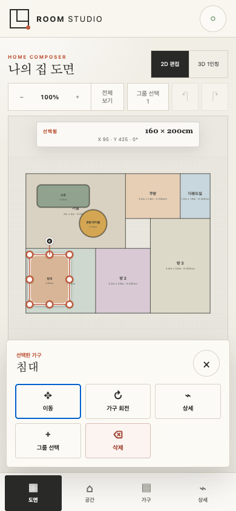
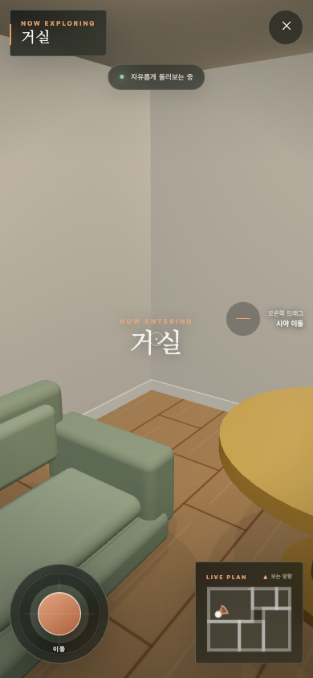

<h1 align="center">Room Studio</h1>

<p align="center">
  <a href="https://github.com/achieve0410/room-studio/actions/workflows/ci.yml"></a>
  <a href="LICENSE"></a>
  <a href="https://achieve0410.github.io/room-studio/"></a>
</p>

<p align="center">
  <strong>Plan in 2D. Validate fit. Walk it in 3D — from desktop or mobile.</strong>
</p>
<p align="center">
  <a href="https://achieve0410.github.io/room-studio/"><strong>Open the live demo →</strong></a>
  ·
  <a href="#quick-start">Run locally</a>
  ·
  <a href="README.ko.md">한국어</a>
</p>
<p align="center"><sub>The public demo stores drawings only in this browser and does not enable login.</sub></p>

Room Studio is a mobile-friendly, browser-based 2D/3D room planner. It combines calibrated floor-plan tracing, orthogonal room shapes, furniture, walls, openings, exact dimensions, height validation, and first-person or overhead WebGL previews without requiring a desktop CAD application.

> Room Studio is a planning and visualization aid, not a substitute for architectural, structural, accessibility, or permit drawings.

## See Room Studio in action

These are screenshots from the running application, not design mockups. Select any image to open it at full resolution.

### 1. Edit directly on the floor plan

[](docs/images/room-studio-2d.png)

Visible resize handles, continuous rotation, live dimensions, snapping guides, multi-selection, and exact property fields keep editing close to the canvas.

### 2. Walk through the same design in 3D

[](docs/images/room-studio-3d.png)

Doors and sash windows remain interactive while furniture, labels, collision boundaries, room transitions, and the live minimap reflect the plan.

### 3. Keep editing and exploring on mobile

| Direct touch editing | Multi-selection | 3D joystick walkthrough |
| --- | --- | --- |
| <a href="docs/images/room-studio-mobile-edit.png"></a> | <a href="docs/images/room-studio-mobile.png"></a> | <a href="docs/images/room-studio-mobile-3d.png"></a> |
| Tap a selected object to expose move, rotate, group, and delete actions. | Select several spaces or objects and transform them as one group. | Move with the left joystick, look around on the right, and follow the live plan. |

## Live demo

Open the [public Room Studio demo](https://achieve0410.github.io/room-studio/). The demo has no Supabase configuration or login: drawings remain in that browser's `localStorage`, and clearing site data removes them. Do not enter a private or security-sensitive floor plan.

## Highlights

- Compose L-shaped and other orthogonal spaces from multiple rectangular parts.
- Import a PNG or JPG floor plan, calibrate it from two known points, and control its opacity or movement lock.
- Add persistent distance dimensions and enter exact wall lengths in centimeters.
- Move, resize, continuously rotate, group, align, and multi-select with on-canvas handles and live transform feedback.
- Duplicate, copy, paste, lock, and nudge selected objects in 1 cm keyboard increments.
- Edit room ceiling height and furniture elevation to validate vertical fit.
- Use swing doors, two-panel bypass sliding doors, and sash-style sliding windows in both 2D and 3D.
- Switch between collision-aware first-person, dollhouse, and top-down 3D views; hide ceilings, focus the current selection, or save the current scene as PNG.
- Work with mouse and keyboard or mobile touch, pinch zoom, resize handles, and a virtual joystick.
- Keep drawings in local browser storage, or optionally sync user-owned projects through Supabase Auth and Postgres RLS.

## Requirements

- Node.js 22.12 or newer (below Node 25)
- npm
- A current Chromium, Firefox, or Safari browser with WebGL support

## Quick start

```bash
npm ci
npm run dev
```

The core editor works without any cloud configuration and stores the current drawing in `localStorage`.

## Validation

```bash
npm run check
npm run test:browser:mobile
```

`npm run check` performs syntax checks, unit tests, and a production build. The browser audit launches a local Vite preview and exercises the supported mobile and desktop flows in Chrome.

## Optional Supabase sync

1. Create a Supabase project.
2. Apply `supabase/migrations/20260721000000_auth_projects.sql`.
3. Enable email sign-in and, if desired, Google OAuth.
4. Register every development or deployment origin in Supabase Auth redirect URLs.
5. Copy `.env.example` to `.env` and enter the public project values.

```dotenv
VITE_SUPABASE_URL=https://YOUR_PROJECT.supabase.co
VITE_SUPABASE_PUBLISHABLE_KEY=sb_publishable_YOUR_KEY
```

Only the Supabase publishable key belongs in browser configuration. Never place a `service_role` key or OAuth client secret in this repository or in Vite environment variables. See [Self-hosting](docs/SELF_HOSTING.md) for the complete deployment contract.

## Private Tailscale sharing

The included script builds on `tailscale serve` without resetting unrelated handlers. It auto-detects the current device's MagicDNS hostname and defaults to HTTPS `8443` forwarding to Vite preview on `127.0.0.1:4173`.

```bash
npm run build
./scripts/tailscale-private-serve.sh start
./scripts/tailscale-private-serve.sh status
```

Existing installations using those defaults continue to work. Other users can override the hostname and ports with environment variables. See [Tailscale deployment](docs/TAILSCALE.md).

## Architecture

Room Studio deliberately keeps its runtime small: Vite, vanilla JavaScript, Three.js, and an optional dynamically loaded Supabase adapter. See [Architecture](docs/ARCHITECTURE.md) for storage boundaries, rendering modules, and security invariants.

## Contributing and support

- Read [CONTRIBUTING.md](CONTRIBUTING.md) before opening a pull request.
- Use GitHub issues for reproducible bugs and scoped feature proposals.
- Do not disclose vulnerabilities in a public issue; follow [SECURITY.md](SECURITY.md).
- Planned work and explicit non-goals are listed in [ROADMAP.md](ROADMAP.md).

## Privacy

The local-only editor sends no drawing to the project database. A self-hosted operator who enables Supabase becomes responsible for the authentication and drawing data stored in that deployment. See [Privacy and operator responsibilities](docs/PRIVACY.md).

## License

Licensed under the [Apache License 2.0](LICENSE). Commercial use is allowed by the license; the maintainers do not currently operate Room Studio as a paid product.
